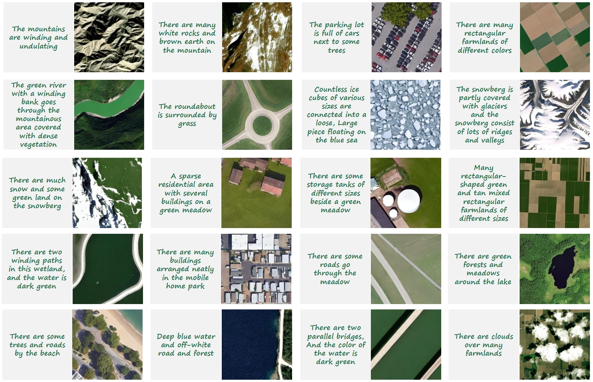

<div align="center">
 <h1>
  
  <a href="https://ieeexplore.ieee.org/document/10591792">Text2Earth: Unlocking Text-driven Remote Sensing Image Generation with a Global-Scale Dataset and a Foundation Model</a>
</h1>

**[Chenyang Liu](https://chen-yang-liu.github.io/), [Keyan Chen](https://kyanchen.github.io), [Rui Zhao](https://ruizhaocv.github.io/), [Zhengxia Zou](https://scholar.google.com.hk/citations?hl=en&user=DzwoyZsAAAAJ), and [Zhenwei Shi*✉](https://scholar.google.com.hk/citations?hl=en&user=kNhFWQIAAAAJ)**


[](https://chen-yang-liu.github.io/Text2Earth/)
[](https://arxiv.org/abs/2501.00895)
[](https://youtu.be/Rw9wzUpO01M)

<div align="center">
  
</div>

</div>


## Share us a :star: if you're interested in this repo

- Official repository of the paper: "**Text2Earth: Unlocking Text-driven Remote Sensing Image Generation with a Global-Scale Dataset and a Foundation Model**" 
- The dataset and model will be publicly available here.
## Latest Updates
- 2025-02: The dataset and model will be publicly available.
- 2025-01: The paper is **available**.

## Table of Contents
- [Git-10M dataset](#Git-10M-dataset)
- [Text2Earth model](#Text2Earth-model)
- [Citation](#Citation)

## Git-10M dataset 
- The Git-10M dataset is a global-scale remote sensing image-text pair dataset, consisting of 10 million image-text pairs with geographical locations and resolution information.
    <br>
    <div align="center">
      
    </div>
    <div align="center">
      
    </div>
    <br>
## Text2Earth model
Building on the Git-10M dataset, we developed Text2Earth, a 1.3 billion parameter generative foundation model. Text2Earth excels in resolution-controllable text2image generation and demonstrates robust generalization and flexibility across multiple tasks.

- **Zero-Shot text2image generation**:
Text2Earth can generate specific image content based on user-free text input, without scene-specific fine-tuning or retraining.
  <br>
  <div align="center">
    
  </div>
  <div align="center">
    
  </div>
  <br>

  On the previous benchmark dataset RSICD, Text2Earth surpasses the previous models with a significant improvement of +26.23 FID and +20.95% Zero-shot OA metric.
  <br>
  <div align="center">
    
  </div>
  <br>

- **Unbounded Remote Sensing Scene Construction**:
Using our Text2Earth, users can seamlessly and infinitely generate remote sensing images on a canvas, effectively overcoming the fixed-size limitations of traditional generative models. Text2Earth’s resolution controllability is the key to maintaining visual coherence across the generated scene during the expansion process.
    <br>
    <div align="center">
      
    </div>
    <br>

- **Remote Sensing Image Editing**:
Text2Earth can perform scene modifications based on user-provided text such as replacing or removing geographic features. And it ensures that these modifications are seamlessly integrated with the surrounding areas, maintaining continuity and coherence.
    <br>
    <div align="center">
      
    </div>
    <br>

- **Cross-Modal Image Generation**:
Text2Earth can be used for Text-Driven Multi-modal Image Generation, including RGB, SAR, NIR, and PAN images.
    <br>
    <div align="center">
      
    </div>
    <br>

  Text2Earth also exhibits potential in Image-to-Image Translation, containing cross-modal translation and image enhancement, such as PAN to RGB (PAN2RGB), NIR to RGB (NIR2RGB), PAN to NIR (PAN2NIR), super-resolution, and image dehazing.
  <br>
      <div align="center">
        
      </div>
      <br>

## Citation
If you find this paper useful in your research, please consider citing:
```
@article{liu2025text2earth,
  title={Text2Earth: Unlocking Text-driven Remote Sensing Image Generation with a Global-Scale Dataset and a Foundation Model},
  author={Liu, Chenyang and Chen, Keyan and Zhao, Rui and Zou, Zhengxia and Shi, Zhenwei},
  journal={arXiv preprint arXiv:2501.00895},
  year={2025}
}
```

## License
This repo is distributed under [MIT License](https://github.com/Chen-Yang-Liu/Change-Agent/blob/main/LICENSE.txt). The code can be used for academic purposes only.

[//]: # (## Contact Us)

[//]: # (If you have any other questions❓, please contact us in time 👬)
