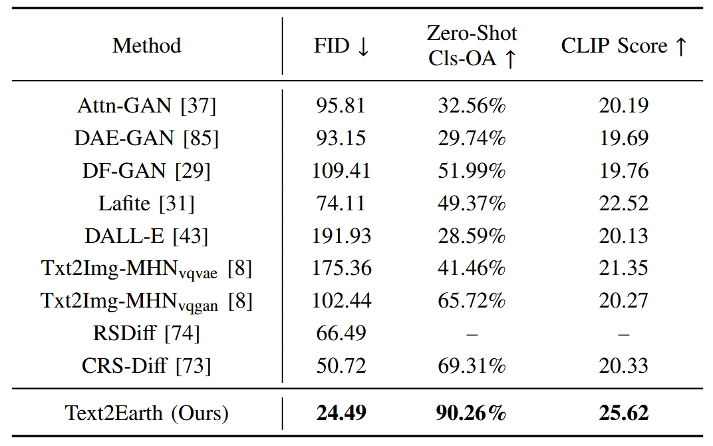

<div align="center">
 <h1>
<!--    -->
  <a href="https://ieeexplore.ieee.org/document/10591792">Text2Earth: Unlocking Text-driven Remote Sensing Image Generation with a Global-Scale Dataset and a Foundation Model</a>
</h1>

**[Chenyang Liu](https://chen-yang-liu.github.io/), [Keyan Chen](https://kyanchen.github.io), [Rui Zhao](https://ruizhaocv.github.io/), [Zhengxia Zou](https://scholar.google.com.hk/citations?hl=en&user=DzwoyZsAAAAJ), and [Zhenwei Shi*✉](https://scholar.google.com.hk/citations?hl=en&user=kNhFWQIAAAAJ)**


[](https://chen-yang-liu.github.io/Text2Earth/)
[](https://ieeexplore.ieee.org/document/10988859)
[](https://youtu.be/Rw9wzUpO01M)

<div align="center">
  
</div>

</div>


## Share us a :star: if you're interested in this repo

This is official repository of the paper: ["**Text2Earth: Unlocking Text-driven Remote Sensing Image Generation with a Global-Scale Dataset and a Foundation Model**"](https://ieeexplore.ieee.org/document/10988859), accepted by **IEEE Geoscience and Remote Sensing Magazine**.


## ## News 🔥
✅ 2025.06.01: **Git-RSCLIP** series downloads exceeded **60,000** times 🔥

✅ 2025-04-16: The paper has been accepted by **IEEE Geoscience and Remote Sensing Magazine**.

✅ 2025-03-03: Our **Git-RSCLIP** model **available**: [[🤗 Huggingface](https://huggingface.co/lcybuaa/Git-RSCLIP) | [🌊 Modelscope](https://modelscope.cn/models/lcybuaa1111/Git-RSCLIP)]

✅ 2025-02-20: The **Git-10M** dataset is **available**: [[🤗 Huggingface](https://huggingface.co/datasets/lcybuaa/Git-10M) | [🌊 Modelscope](https://modelscope.cn/datasets/lcybuaa1111/Git-10M/)].

✅ 2025-01-01: The paper is **available**.

## Table of Contents
- [🛰️ Git-10M Dataset](#Git-10M-Dataset)
  - [Dataset Download](#Dataset-Download)
  - [Visual Quality Enhancement](#Visual-Quality-Enhancement)
- [🧩 Text2Earth Model](#Text2Earth-Model)
  - [Pre-trained Weights](#Pre-trained-Weights)
  - [Demo-Usage](#Demo-Usage)
  - [Installation](#Installation)
  - [Training](#Training)
  - [Evaluation](#Evaluation)
- [🍀 Git-RSCLIP Model](#Git-RSCLIP-Model)
- [✍️ Citation](#Citation)

## 🛰️ Git-10M Dataset <a id="Git-10M-Dataset"></a>
### Dataset Download
- The Git-10M dataset is a **global-scale** dataset, consisting of **10.5 million** image-text pairs with geographical locations and resolution information.
- The Git-10M dataset is **available** at: [[🤗 Huggingface](https://huggingface.co/datasets/lcybuaa/Git-10M) | [🌊 Modelscope](https://modelscope.cn/datasets/lcybuaa1111/Git-10M/)].

    <br>
    <div align="center">
      
    </div>
    <br>

### Visual Quality Enhancement
- You can skip the following steps if you have higher visual quality requirements for the image. 
- Some collected images exhibited poor visual quality, such as noise and artifact, which could negatively impact the training of image generation models. 
To address this, you can use an image enhancement model pre-trained on my private high-quality remote sensing dataset to improving the overall image quality.

    **Follow the steps below**:
    <details open>

    **Step 1**: 
    ```python
    cd ./Text2Earth/Tools
    ```
    **Step 2**: Run Python code to process images:
    
    ```python
    python visual_quality_enhancement.py \
        --input_dir /path/to/Git-10M/images \
        --output_dir /path/to/Git-10M/enhanced_images
    ```
    
    </details>


## 🧩 Text2Earth Model <a id="Text2Earth-Model"></a>
### Pre-trained Weights
We provide two versions of the model:
- ``Text2Earth`` Link : [[🤗 Huggingface](https://huggingface.co/lcybuaa/Text2Earth) | [🌊 Modelscope](https://modelscope.cn/models/lcybuaa1111/Text2Earth)].
- ``Text2Earth-inpainting`` Link : [[🤗 Huggingface](https://huggingface.co/lcybuaa/Text2Earth-inpainting) | [🌊 Modelscope](https://modelscope.cn/models/lcybuaa1111/Text2Earth-inpainting)].

###  Demo-Usage:
✅ **Loading Usage 1**: Use Text2Earth directly through [[🤗 Diffuser]](https://huggingface.co/docs/diffusers/index) without installing our repository.
<details open>

  - ``Text2Earth`` that generates remote sensing images from text prompts:
  
    ```python
    import torch
    from diffusers import StableDiffusionPipeline, EulerDiscreteScheduler
    
    model_id = "lcybuaa/Text2Earth"
    # Running the pipeline (if you don't swap the scheduler it will run with the default DDIM, in this example we are swapping it to DPMSolverMultistepScheduler):
    scheduler = EulerDiscreteScheduler.from_pretrained(model_id, subfolder="scheduler")
    pipe = StableDiffusionPipeline.from_pretrained(model_id, torch_dtype=torch.float16, scheduler=scheduler, 
                                             custom_pipeline="pipeline_text2earth_diffusion", safety_checker=None)
    pipe = pipe.to("cuda")
    prompt = "Seven green circular farmlands are neatly arranged on the ground"
    image = pipe(prompt,
                 height=256,
                 width=256,
                 num_inference_steps=50, 
                 guidance_scale=4.0).images[0]
    
    image.save("circular.png")
    ```
  - ``Text2Earth-inpainting`` that inpaints remote sensing images based on text prompts and inpainting masks:
    ```python
    import torch
    from diffusers import StableDiffusionInpaintPipeline
    from diffusers.utils import load_image
    
    model_id = "lcybuaa/Text2Earth-inpainting"
    pipe = StableDiffusionInpaintPipeline.from_pretrained(
            model_id, torch_dtype=torch.float16, 
            custom_pipeline='pipeline_text2earth_diffusion_inpaint',
            safety_checker=None
        )
    pipe.to("cuda")
    
    # load base and mask image
    # image and mask_image should be PIL images.
    # The mask structure is white for inpainting and black for keeping as is
    init_image = load_image(r"./Text2Earth/examples/text_to_image/inpainting/sparse_residential_310.jpg")
    mask_image = load_image(r"./Text2Earth/examples/text_to_image/inpainting/sparse_residential_310.png")
    
    prompt = "There is one big green lake"
    image = pipe(prompt=prompt,
                     image=init_image,
                     mask_image=mask_image,
                     height=256,
                     width=256,
                     num_inference_steps=50,
                     guidance_scale=4.0).images[0]
    image.save("lake.png")
    ```
</details>

✅ **Loading Usage 2**: Install our repository (See [Installation](#Installation)), then you can use the provided Pipeline, which is more convenient for users to customize and edit.
<details open>

  - ``Text2Earth`` that generates remote sensing images from text prompts:
  
    ```python
    import torch
    from diffusers import Text2EarthDiffusionPipeline, EulerDiscreteScheduler
    
    model_id = "lcybuaa/Text2Earth"
    # Running the pipeline (if you don't swap the scheduler it will run with the default DDIM, in this example we are swapping it to DPMSolverMultistepScheduler):
    scheduler = EulerDiscreteScheduler.from_pretrained(model_id, subfolder="scheduler")
    pipe = Text2EarthDiffusionPipeline.from_pretrained(model_id, torch_dtype=torch.float16, scheduler=scheduler, 
                                             safety_checker=None)
    pipe = pipe.to("cuda")
    prompt = "Seven green circular farmlands are neatly arranged on the ground"
    image = pipe(prompt,
                 height=256,
                 width=256,
                 num_inference_steps=50, 
                 guidance_scale=4.0).images[0]
    
    image.save("circular.png")
    ```
  - ``Text2Earth-inpainting`` that inpaints remote sensing images based on text prompts and inpainting masks:
    ```python
    import torch
    from diffusers import Text2EarthDiffusionInpaintPipeline
    from diffusers.utils import load_image
    
    model_id = "lcybuaa/Text2Earth-inpainting"
    pipe = Text2EarthDiffusionInpaintPipeline.from_pretrained(
            model_id, torch_dtype=torch.float16, 
            custom_pipeline='pipeline_text2earth_diffusion_inpaint',
            safety_checker=None
        )
    pipe.to("cuda")
    
    # load base and mask image
    # image and mask_image should be PIL images.
    # The mask structure is white for inpainting and black for keeping as is
    init_image = load_image(r"https://github.com/Chen-Yang-Liu/Text2Earth/blob/main/images/sparse_residential_310.jpg")
    mask_image = load_image(r"https://github.com/Chen-Yang-Liu/Text2Earth/blob/main/images/sparse_residential_310.png")
    
    prompt = "There is one big green lake"
    image = pipe(prompt=prompt,
                     image=init_image,
                     mask_image=mask_image,
                     height=256,
                     width=256,
                     num_inference_steps=50,
                     guidance_scale=4.0).images[0]
    image.save("lake.png")
    ```
</details>

✅ NOTE: ``Text2Earth`` and ``Text2Earth-inpainting`` allow users to **specify the spatial resolution** of the generated images, ranging from 0.5m to 128m per pixel. 
This can be achieved by including specific identifiers in the prompt.
```python
# You can indirectly set the spatial resolution by specifying the Google_Map_Level, which ranges from [10, 18], corresponding to resolutions from [128m, 0.5m]. 
# The conversion formula is: **Resolution = 2^(17 - Level)**.
Google_Map_Level = 16 # Resolution = 2**(17-Level)
content_prompt = "Seven green circular farmlands are neatly arranged on the ground"
prompt_with_resolution = '{res}_GOOGLE_LEVEL_' + content_prompt
pipe = xxx #  Text2EarthDiffusionPipeline or Text2EarthDiffusionInpaintPipeline
image = pipe(prompt=prompt_with_resolution, ...).images[0]
```

### Installation

  <details open>

  **Step 1**: Download or clone the repository.
  ```python
  git clone https://github.com/Chen-Yang-Liu/Text2Earth.git
  cd ./Text2Earth
  ```
  **Step 2**: Create a virtual environment named `Text2Earth_env` and activate it.
  ```python
  conda create -n Text2Earth_env python=3.9
  conda activate Text2Earth_env
  ```

  **Step 3**: Install ``accelerate`` then run ``accelerate config``

  **Step 4**: Our Text2Earth is based on [Diffuser](https://huggingface.co/docs/diffusers/installation). Now install Text2Earth:
  ```python
  cd ./Text2Earth
  pip install -e ".[torch]"
  ```
  </details>


[//]: # (# If you set it to set the spatial resolution of generated images, e.g., 0.5, 1, 2,...,128.)

[//]: # (# None, the model will use the default resolution of 256.)

[//]: # (Resolution = None # )

[//]: # (if Resolution is not None:)

[//]: # (    res_prompt = '{Resolution}_GOOGLE_LEVEL_')

[//]: # (else:)

[//]: # (    res_prompt = prompt)


### Training
Code is coming soon.
### Evaluation
Code is coming soon.

### Experimental Results 
Building on the Git-10M dataset, we developed Text2Earth, a 1.3 billion parameter generative foundation model. Text2Earth excels in resolution-controllable text2image generation and demonstrates robust generalization and flexibility across multiple tasks.

- **Comparison of Text2image models on the previous benchmark dataset (RSICD)**:

  On the previous benchmark dataset RSICD, Text2Earth surpasses the previous models with a significant improvement of +26.23 FID and +20.95% Zero-shot OA metric.
    <br>
    <div align="center">
      
    </div>
    <br>

- **Zero-Shot text2image generation**:
Text2Earth can generate specific image content based on user-free text input, without scene-specific fine-tuning or retraining.
  <br>
  <div align="center">
    
  </div>
  <div align="center">
    
  </div>
  <br>

- **Unbounded Remote Sensing Scene Construction**:
Using our Text2Earth, users can seamlessly and infinitely generate remote sensing images on a canvas, effectively overcoming the fixed-size limitations of traditional generative models. Text2Earth’s resolution controllability is the key to maintaining visual coherence across the generated scene during the expansion process.
    <br>
    <div align="center">
      
    </div>
    <br>

- **Remote Sensing Image Editing**:
Text2Earth can perform scene modifications based on user-provided text such as replacing or removing geographic features. And it ensures that these modifications are seamlessly integrated with the surrounding areas, maintaining continuity and coherence.
    <br>
    <div align="center">
      
    </div>
    <br>

- **Cross-Modal Image Generation**:
Text2Earth can be used for Text-Driven Multi-modal Image Generation, including RGB, SAR, NIR, and PAN images.
    <br>
    <div align="center">
      
    </div>
    <br>

  Text2Earth also exhibits potential in Image-to-Image Translation, containing cross-modal translation and image enhancement, such as PAN to RGB (PAN2RGB), NIR to RGB (NIR2RGB), PAN to NIR (PAN2NIR), super-resolution, and image dehazing.
  <br>
  <div align="center">
    
  </div>
  <br>


## 🍀 Git-RSCLIP Model <a id="Git-RSCLIP-Model"></a>
   - The Git-RSCLIP model is a remote sensing image-text foundation model, which is trained on the Git-10M dataset.
   - For more details, please see the github repository: [[Github](https://github.com/Chen-Yang-Liu/Git-RSCLIP)]

## ✍️️ Citation
If you find this paper useful in your research, please consider citing:
```
@ARTICLE{10988859,
  author={Liu, Chenyang and Chen, Keyan and Zhao, Rui and Zou, Zhengxia and Shi, Zhenwei},
  journal={IEEE Geoscience and Remote Sensing Magazine}, 
  title={Text2Earth: Unlocking text-driven remote sensing image generation with a global-scale dataset and a foundation model}, 
  year={2025},
  volume={},
  number={},
  pages={2-23},
  doi={10.1109/MGRS.2025.3560455}}
```

## 📖 License
This repo is distributed under [MIT License](https://github.com/Chen-Yang-Liu/Change-Agent/blob/main/LICENSE.txt). The code can be used for academic purposes only.

[//]: # (## Contact Us)

[//]: # (If you have any other questions❓, please contact us in time 👬)

